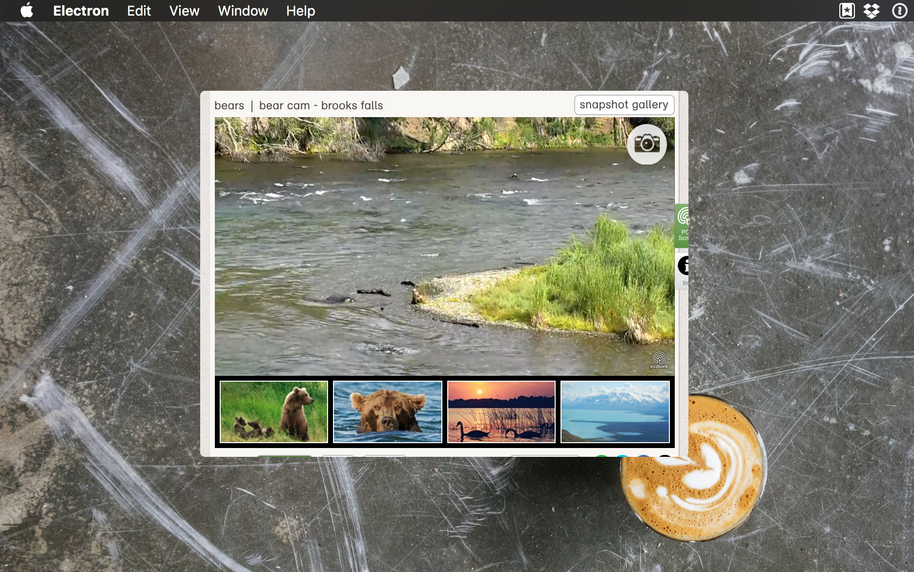

# Floaty 

Floaty is a floating browser window that displays a live feed of bears eating salmon in Katmai, Alaska.

## To Use

To clone and run this repository you'll need [Git](https://git-scm.com) and [Node.js](https://nodejs.org/en/download/) (which comes with [npm](http://npmjs.com)) installed on your computer. From your command line:

```bash
# Clone this repository
git clone [???]
# Go into the repository
cd floaty
# Install dependencies
npm install
# Run the app
npm start
```



[Original link to live camera](http://explore.org/live-cams/player/brown-bear-salmon-cam-brooks-falls)